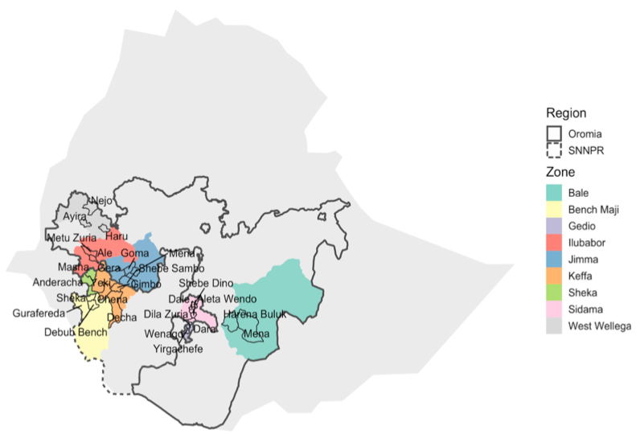

% 
  

## The research paper

This website provides easy access to commented R scripts that allows reproducing the analysis of the data from our publication.

In this work, several hundred fields were surveyed across nine geographic zones of Ethiopia in a single season during the peak of CLR intensity of the epidemics. Descriptive and inferential statistics were used to document and model the effect o geography, field characteristics such as elevation and the associated farming practices on disease incidence and severity. 

## Cite this compendium

> Del Ponte, E. M., & Belachew, K. (2020, June 14). Research Compendium: Altitude is the main driver of coffee leaf rust epidemic - a large-scale survey in Ethiopia. <a href="https://doi.org/10.17605/OSF.IO/XEJAZ">https://doi.org/10.17605/OSF.IO/XEJAZ</a>

